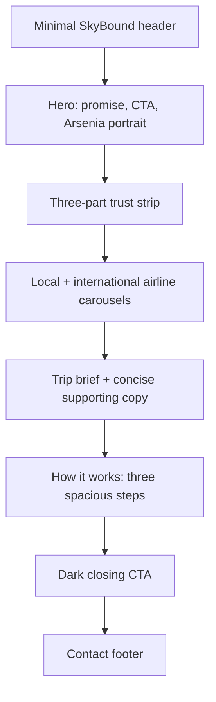

# SkyBound Travel Hub — Editorial Concierge Redesign

## Status

Approved visual direction: **Direction A — Editorial concierge**, revised with the **SkyBound Travel Hub** agency identity, full Local and International airline carousels, and restrained motion.

## Objective

Recompose the entire landing page so it feels like a premium personal travel-consulting experience rather than a collection of cramped promotional cards. The sole conversion remains opening a Messenger conversation with `arsenia.balinario`.

The redesign must make three things immediately clear:

1. Arsenia is a real person who can help.
2. She represents SkyBound Travel Hub and can help visitors explore broad airline coverage.
3. Starting requires only one Messenger message.

## Experience Principles

- **Editorial, not card-heavy.** Use full-width page bands, strong typography, and intentional whitespace. Enclose content only when a boundary communicates something useful.
- **One idea per section.** Proof, preparation, and conversion must not compete inside the same horizontal cluster.
- **Human trust first.** Arsenia is the primary human anchor; SkyBound Travel Hub is the agency identity around her service.
- **Recognizable coverage, not decorative density.** Airline marks provide quick recognition without implying a formal partnership or turning the page into a logo wall.
- **One action.** Messenger is the only primary action. Phone and email remain fallback contact information in the footer.
- **Motion with purpose.** A brief page-load reveal and small hover responses add depth; nothing loops continuously or competes with the Messenger action.

## Page Composition

### 1. Header

- Use `SkyBound Travel Hub | Arsenia` as the compact agency-and-consultant lockup.
- Keep the header quiet and compact so it supports orientation without competing with the hero.
- Include one text-level Messenger action on larger screens.

### 2. Hero

- Use an asymmetric two-column layout with copy on the left and Arsenia on the right.
- Lead with the headline: **“A simpler, more personal way to book your next flight.”**
- Supporting copy: **“Chat directly with Arsenia for local and international flight options, fare questions, and clear booking guidance—all in Messenger.”**
- Keep one Messenger button and one reassurance line in the primary reading path.
- Primary CTA: **“Chat with Arsenia on Messenger.”** Reassurance: **“No forms. No signup. Start with a simple message.”**
- Use a newly generated, identity-preserving portrait derived from the supplied image. The result must remove the poster background, restore a natural complete shoulder line, and avoid looking like a crop or masked flyer asset.
- Keep the portrait presentation editorial and restrained: no boarding-pass motif, floating badges, artificial gradients, or overlapping information cards.

### 3. Trust Strip

- Present three short credibility statements in a single quiet band.
- Use thin dividers, not three separate cards.
- Each item gets one label and one supporting line.
- Use these three messages: **Personal guidance**, **Local and international flights**, and **One simple Messenger thread**.

### 4. Airline Coverage Band

- Give airline coverage its own compact, full-width section.
- Include all 30 airline marks shown on the supplied poster: 10 local and 20 international.
- Present them as two categorized, user-controlled carousels—**Local airlines** and **International airlines**—with previous/next controls, touch swiping, native horizontal scrolling, and keyboard support.
- Do not autoplay or create a continuously moving marquee. Motion occurs only when the visitor navigates.
- Use locally hosted, full-color vector or high-resolution transparent marks from official-origin or established airline-logo sources; do not redraw airline identities or crop them from the low-resolution poster.
- Pair each mark with accessible airline naming and the label **“Airlines frequently requested.”**
- State that availability depends on route and schedule. Do not imply endorsement or partnership.
- This section establishes breadth; it must not repeat the flyer or explain the booking process.

### 5. Trip Brief

- Remove the old Global Pinoy flyer from the rendered site because it conflicts with the new agency name. Preserve the source file in the repository as archival source material.
- Use a calm two-column editorial composition: a single spacious **“Trip brief”** graphic on the left and concise copy on the right.
- The brief contains only route, dates, and traveler count. Its website-graphic context carries its role without visible “example” or “illustrative” qualifiers, and it must not resemble a quote, fare promise, or completed booking.
- Use open space and hairline dividers rather than a cluster of small cards.

### 6. How It Works

- Move preparation into a separate, spacious section titled around what happens next.
- Show three steps in one horizontal sequence on desktop and a vertical sequence on mobile.
- Use large step numbers, short headings, and one concise explanatory line per step.
- Use the sequence **Share your trip → Review flight options → Continue with Arsenia**.
- Do not enclose the entire sequence in a narrow card.

### 7. Closing CTA

- Use one dark, full-width section to create a clear visual conclusion.
- Include a short example message as supportive content, not a competing card.
- Repeat the primary Messenger button once.

### 8. Footer and Mobile Conversion Continuity

- Keep phone and email as fallback contact details in the footer.
- Keep the hero CTA as the only primary action in the initial mobile viewport.
- Do not use an always-visible mobile overlay; the header lockup, proof link, and closing CTA preserve conversion access through the page without covering content.

## Visual System

### Layout and Spacing

- Main content width: approximately `1120–1200px`.
- Desktop section spacing: `96–120px` vertically.
- Mobile section spacing: `64–80px` vertically.
- Primary column gap: at least `64px` on wide screens.
- Component-internal spacing follows a consistent 8px-derived rhythm.
- Body-copy measure stays around `55–65` characters per line.
- Cards may not be used merely to fill a grid; every enclosure must have a semantic reason.

### Typography

- Use a confident editorial scale with restrained weights.
- H1: approximately `64–72px` desktop, `44–52px` mobile.
- H2: approximately `42–52px` desktop, `34–40px` mobile.
- Body copy: `17–19px` with generous line-height.
- Reserve uppercase tracking for small section labels only.
- Avoid making headings, labels, and cards equally bold.

### Color and Surfaces

- Keep a warm-white paper surface and deep navy text.
- Use Messenger blue only for interactive emphasis.
- Use a dark navy closing section to establish a strong end point.
- Avoid decorative gradient blobs, colored glows, excessive shadows, and multiple competing accent colors.
- Alternate white and warm-neutral section bands to create rhythm without relying on cards.

### Imagery and Marks

- Hero portrait: generated from the supplied reference with identity preserved, background removed or replaced with a subtle neutral editorial treatment, and the missing shoulder naturally reconstructed.
- Airline marks: presented at a consistent optical scale inside scroll-snapped cells with restrained separators.
- The portrait must not be stretched, over-cropped, or masked to hide obvious generation/cropping defects.

### Motion

- Orchestrate one brief hero entrance: eyebrow, headline, supporting copy, CTA, then portrait.
- Give airline marks and text links small hover/focus responses only; no infinite marquee, bouncing CTA, parallax, or scroll-jacking.
- Keep animation on opacity and transform for smooth rendering.
- Respect `prefers-reduced-motion` by reducing every motion effect to an effectively static state.

## Responsive Behavior

- Desktop hero remains a balanced two-column composition.
- Mobile hero keeps the copy and Messenger action first, followed immediately by the portrait.
- Trust items and process steps stack vertically with clear dividers.
- Airline coverage may become a horizontally scrollable rail if logos are used.
- The trip-brief section stacks the graphic first, explanation second, with generous separation.
- No section should create horizontal overflow or force text into narrow measures.

## Technical Shape

- Refactor the current single page into clearly named section components where that improves readability.
- Centralize repeated color, spacing, radius, and shadow decisions in the existing global styling layer rather than repeating arbitrary values throughout JSX.
- Reuse the current Next.js and Tailwind setup; implement motion in CSS and add no UI or animation dependency.
- Generate the revised portrait as a new asset and replace the current cutout only after visual inspection.
- Preserve the existing Messenger URL, metadata intent, accessibility skip link, focus states, and reduced-motion handling.

## Acceptance Criteria

- The proof area no longer combines headline copy, instructions, and the flyer in three cramped columns.
- “What happens next” is a standalone section with visibly more breathing room.
- The page uses one coherent spacing and typography system from hero through footer.
- Arsenia's portrait has no visibly missing shoulder, poster bleed, harsh mask edge, or improvised crop.
- SkyBound Travel Hub appears consistently in the header, portrait caption, metadata, and footer; the former agency name does not render.
- All 30 poster airline entries are recognizable, accessible, optically balanced, and grouped into Local and International carousels without implying a partnership.
- The trip brief does not make a fare or availability claim and does not label itself as an example or illustration.
- Motion is subtle, non-looping, and effectively disabled when reduced motion is requested.
- Messenger is the only primary CTA and works from every placement.
- Phone and email remain accessible as fallback details.
- The layout is visually checked at approximately 375px, 768px, and 1440px widths.
- Keyboard focus, text contrast, touch targets, and reduced-motion behavior remain accessible.
- Lint and production build pass after implementation.

## Non-goals

- No booking form, scheduler, quote calculator, account, or backend.
- No fabricated testimonials, response-time guarantees, or airline partnerships.
- No new visual framework, animation library, autoplaying logo marquee, or unrelated refactor.
